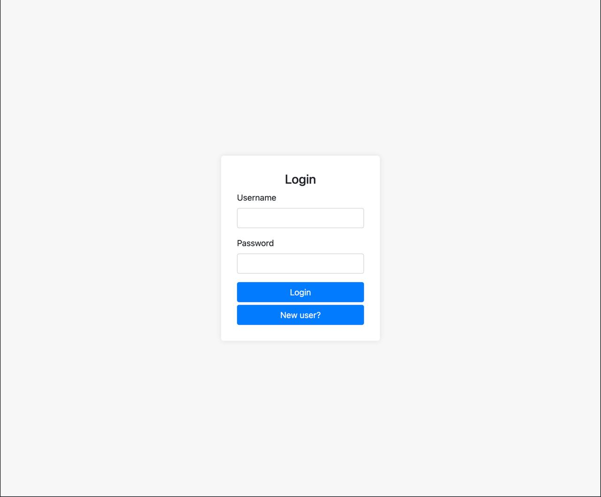

# lists-project

## Description
Project for creating lists

## How to start?

If you want to run - set correct jdbc path for database (and set credentials if they exist) in ```src/properties/application.properties```

To run use: ```./gradlew run```

To test use: ```./gradlew test```

## Functionality

* Login/sign up
* Create lists
* See all your lists

## Dependencies

* PostgreSQL
* Spring Boot
* Spring MVC
* Spring Security
* JUnit 4

## Screenshots





